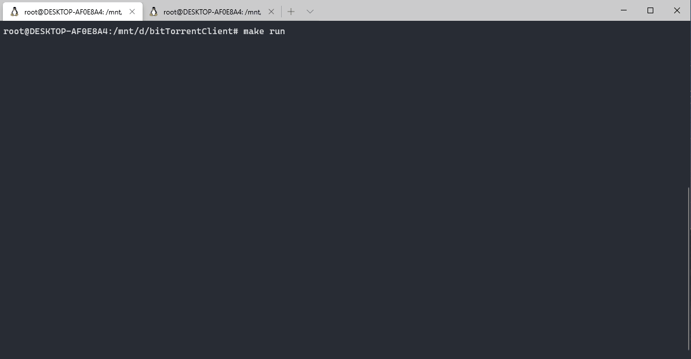

This project is solely for learning P2P technology purposes.
Project structure, implementation and ideas are heavily inspired/learned from the following blog posts/articles/repositories/university course projects description:
- https://github.com/cenkalti/rain
- http://www.cse.chalmers.se/~tsigas/Courses/DCDSeminar/Files/BitTorrent.pdf
- http://dandylife.net/docs/BitTorrent-Protocol.pdf
- https://www.bittorrent.org/beps/bep_0003.html
- https://www.cs.rochester.edu/courses/257/fall2017/projects/gp.html
- https://blog.jse.li/posts/torrent/

To use this application: 
1. make build
2. make run
(If failed to use download from the testing torrent file, that's probably the torrent is expired as the archLinux torrent is frequently replaced in the tracker side)

Additional features to build in the future:
1. Adding support to magnet link
2. Download multiple files from one torrent
3. Support communcation to HTTPS tracker

Current feature:
1. Download single file only
2. Communicate to http tracker
3. Goroutines to download multiple pieces of the file concurrently, synchrouns by Channel.
4. Client is only a leecher+

Known issue:
